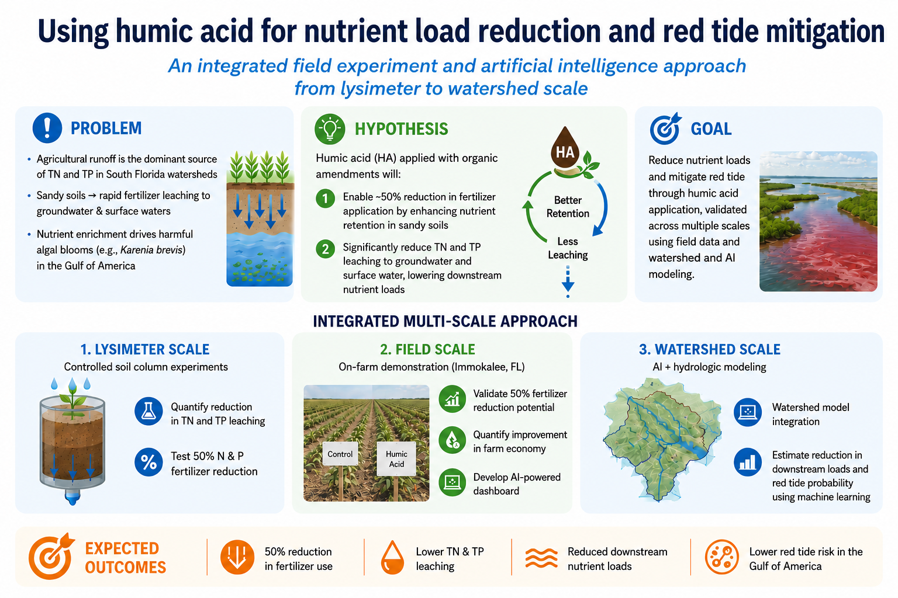

# Using Humic Acid for Nutrient Reduction and Red Tide Mitigation

  
An integrated field experiment and AI approach from lysimeter to watershed scale

  
Testing whether humic acid can improve nutrient retention in South Florida's sandy soils, reduce fertilizer losses, maintain crop performance, and lower downstream nutrient loading and red-tide risk.

  

    EPA Region 42026–2029Southwest FloridaCurrent phase: field readiness
  

  <strong>Project status — implementation phase.</strong> The January 2027 field launch is being prepared. Quantities described as targets, hypotheses, or planned outcomes are <strong>not project results</strong> and will be replaced with measured results as they become available.

  
<b>3</b>connected scales<small>Lysimeter → Field → Watershed</small>

  
<b>4</b>Task 1 treatment groups<small>3 replicates per group</small>

  
<b>3</b>partner universities<small>FGCU · UF/IFAS · FSU</small>

  
<b>Jan 2027</b>field launch target<small>Task 1 & Task 2</small>

## Project at a glance

The project links controlled experiments, commercial-scale validation, watershed modeling, machine learning, and decision support. The central hypothesis is that humic acid can improve nutrient and water retention in sandy soils and make a substantial reduction in nitrogen and phosphorus fertilizer inputs feasible while reducing leaching.

Integrated project framework from the September 2026 planning presentation.

  <a class="ha-card" href="research/task1.html">01<h3>Lysimeter-scale experiment</h3>
Quantify nutrient movement below the root zone under background, conventional, and humic-acid treatments.
Explore Task 1 →</a>
  <a class="ha-card" href="research/task2.html">02<h3>Field-scale validation</h3>
Test agronomic, water-quality, crop-health, and economic performance under commercial tomato production conditions.
Explore Task 2 →</a>
  <a class="ha-card" href="research/task3.html">03<h3>Watershed-to-coast modeling</h3>
Scale measured nutrient reductions, evaluate red-tide response, and translate results into decision-support tools.
Explore Task 3 →</a>

## What is happening now?

  

    <button class="ha-tab active" data-tab="done">Completed</button>
    <button class="ha-tab" data-tab="now">In progress</button>
    <button class="ha-tab" data-tab="next">Next</button>
  

  
<b>Project startup:</b> kickoff meeting completed; experimental site visit and initial site selection completed; FGCU–UF planning workshop held on September 8, 2026.

  
<b>Implementation readiness:</b> QAPP refinement, procurement of lysimeter/sensors/well materials/humic acid, final experimental design, laboratory selection, and field installation planning.

  
<b>Pre-launch:</b> install monitoring infrastructure, complete baseline sampling and setup tests, begin monitoring in late December, and initiate Tasks 1 and 2 in January 2027.

## Follow the project

Use the navigation panel to move from the scientific rationale to each research task, the QAPP/data-quality framework, current progress, the project team, and future outputs. The **Progress** page is designed to be updated after every major field visit or project meeting, while the **Outputs** page is ready for publications, datasets, presentations, and dashboards as they become available.
