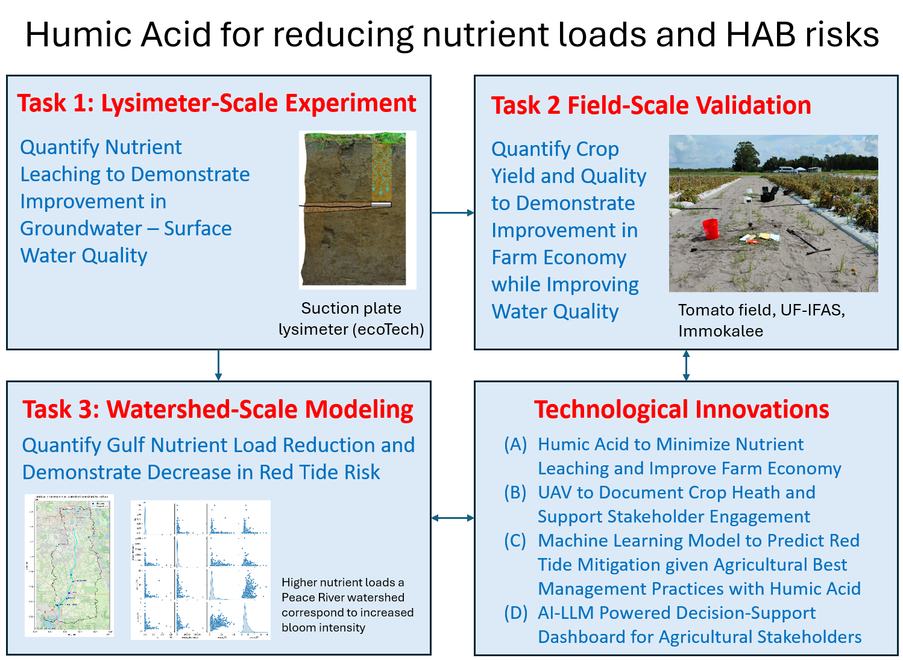

# Project Overview

  <strong>Project status — implementation phase.</strong> The January 2027 field launch is being prepared. Quantities described as targets, hypotheses, or planned outcomes are <strong>not project results</strong> and will be replaced with measured results as they become available.

## The problem

Agricultural nutrient losses are a major water-quality concern in South Florida. Sandy soils typically have low organic matter, low water-holding capacity, and low nutrient-retention capacity, allowing applied nitrogen and phosphorus to move below the crop root zone and into groundwater and connected surface waters.

## The hypothesis

The project tests whether **humic acid (HA)** can improve nutrient and water retention in sandy soils sufficiently to support a major reduction in fertilizer inputs while maintaining or improving tomato production. The project then traces the implications of measured nutrient reductions from the farm scale to the Peace River–Charlotte Harbor coastal system.

  
<b>Humic acid</b>soil conditioning
<i>→</i>
  
<b>Root zone</b>nutrient + water retention
<i>→</i>
  
<b>Leaching</b>lower N & P losses
<i>→</i>
  
<b>Watershed</b>reduced nutrient loads
<i>→</i>
  
<b>Coast</b>lower predicted HAB risk

## Core research questions

1. Can humic acid reduce nitrogen and phosphorus leaching from sandy agricultural soils?
2. Can fertilizer use be reduced by approximately 50% while maintaining or improving tomato yield and quality?
3. How would large-scale humic-acid adoption affect nutrient loads from the Peace River watershed to downstream receiving waters?
4. Would those nutrient reductions lower the predicted probability, frequency, or severity of *Karenia brevis* red tide?
5. How can UAV, machine-learning, and LLM-based tools support farmer and watershed-management decisions?

## The multiscale design

The logic is intentionally sequential: **Task 1** establishes process-level evidence, **Task 2** tests practical performance at field scale, and **Task 3** uses qualified results from Tasks 1 and 2 to evaluate watershed and coastal implications.

## Intended outcomes

<h3>Environmental</h3>
<ul><li>Quantified TN and TP leaching reduction.</li><li>Reduced modeled nutrient delivery to Charlotte Harbor.</li><li>Scenario-based estimates of changes in red-tide risk.</li><li>Transparent sensitivity and uncertainty analyses.</li></ul>

<h3>Agricultural & decision support</h3>
<ul><li>Evidence on fertilizer-use reduction feasibility.</li><li>Crop yield, quality, and economic assessment.</li><li>UAV-based crop-health visualization.</li><li>AI/LLM-supported access to project findings.</li></ul>

> **Interpretation note:** these are project goals and planned outcomes. They should not be presented as achieved results until measurements and model analyses are complete and quality-reviewed.
