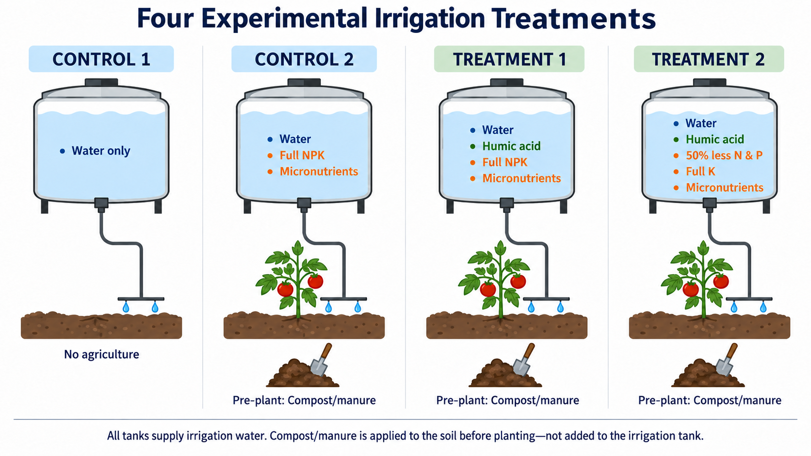
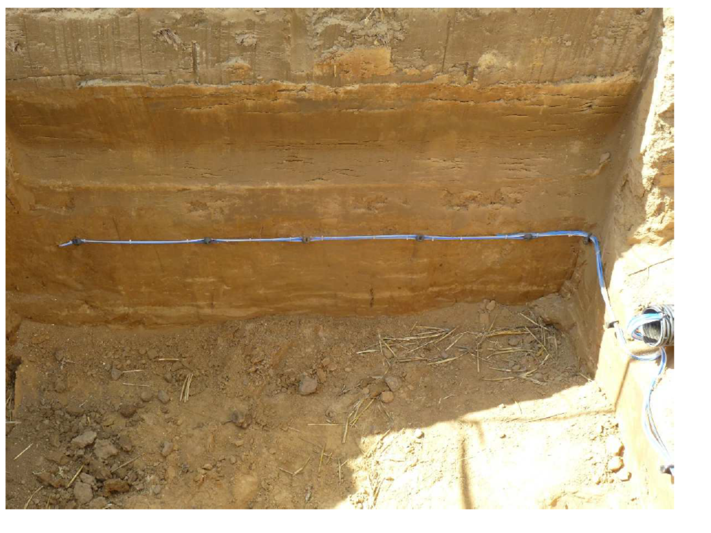
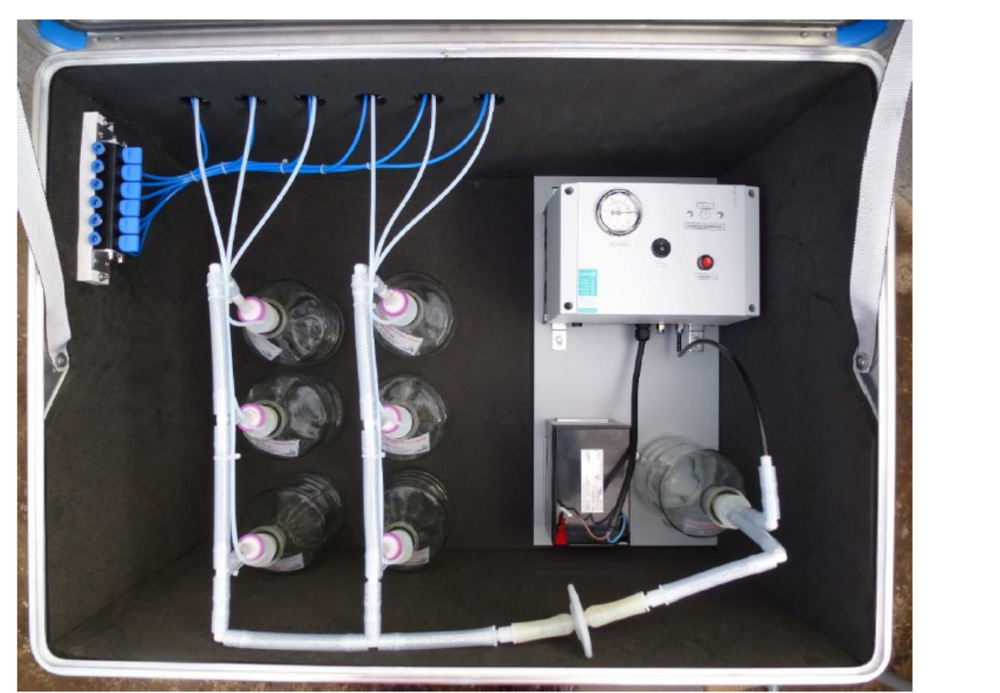

# Task 1 — Lysimeter-Scale Experiment

  <strong>Project status — implementation phase.</strong> The January 2027 field launch is being prepared. Quantities described as targets, hypotheses, or planned outcomes are <strong>not project results</strong> and will be replaced with measured results as they become available.

## Objective

Quantify nitrogen and phosphorus movement below the tomato root zone and determine whether humic acid improves nutrient retention and reduces leaching in Southwest Florida sandy soil.

IN PREPARATION<b>Two growing seasons · four operational treatment groups · three independent replicates</b>

## Current experimental design

The September 2026 QAPP operationalizes **four treatment groups**:

| Group | Purpose | Current implementation concept |
|---|---|---|
| Background control | Establish background conditions | Water-only / background reference; final field implementation to follow the approved QAPP |
| Conventional practice | Regional baseline | 100% recommended nutrient input |
| HA treatment 1 | Isolate HA effect at full nutrients | Humic acid + 100% nutrient input |
| HA treatment 2 | Test fertilizer-reduction hypothesis | Humic acid + approximately 50% reduced N and P input |

Current treatment schematic from the planning presentation. The approved QAPP will remain the controlling implementation document.

## What will be measured?

  
<button class="ha-tab active" data-tab="water">Soil water</button><button class="ha-tab" data-tab="sensors">Sensors</button><button class="ha-tab" data-tab="crop">Crop</button><button class="ha-tab" data-tab="qa">QA/QC</button>

  
<b>Primary nutrient analytes:</b> TN, TP, nitrate/nitrite-N, ammonia-N, and soluble reactive phosphorus (SRP), with field temperature, pH, and electrical conductivity used to characterize sample conditions.

  
<b>Hydrologic context:</b> soil water content, soil temperature, soil water potential, rainfall/meteorology, irrigation, and related logger records. Final sensor allocation will follow the approved field plan.

  
<b>Plant response:</b> biomass, tissue nutrients, total and marketable yield, fruit weight/size, firmness, nutrient content, and shelf life as applicable.

  
<b>Quality controls:</b> treatment records, replicate tracking, calibration checks, field/lab QC, chain-of-custody, versioned data, and documented usability review.

## Lysimeter and below-root-zone sampling

Suction plates are planned approximately **5–10 cm below the active root zone**, with depth finalized relative to actual tomato rooting. This is intended to capture water and nutrients leaving the effective root zone rather than only characterizing the surface soil.

Example soil profile / installation context.

Example suction-plate lysimeter collection system.

## Sampling strategy

The draft QAPP uses **Full** and **Mini** sampling events so that the project can retain treatment/replicate information at strategic times while controlling analytical cost. Full events retain the 12 individual replicate samples for the complete analytical panel; Mini events use treatment-level composites for TN and TP. Dates are intentionally adjustable around fertilizer/fertigation, irrigation, rainfall, crop-development stage, and harvest.

## Planned analysis

Primary comparisons will focus on concentration and mass-load differences among treatments, nutrient retention/leaching response to hydrologic forcing, and whether the HA + reduced-fertilizer treatment maintains agronomic performance while reducing nutrient losses.

## Status checkpoints

- **Completed:** initial site visit and preliminary site selection; core lysimeter procurement initiated.
- **In progress:** final design/QAPP, sensor and supply procurement, laboratory selection, installation planning, sampling plan refinement.
- **Next:** infrastructure installation, system testing, baseline sampling, and January 2027 experiment launch.
