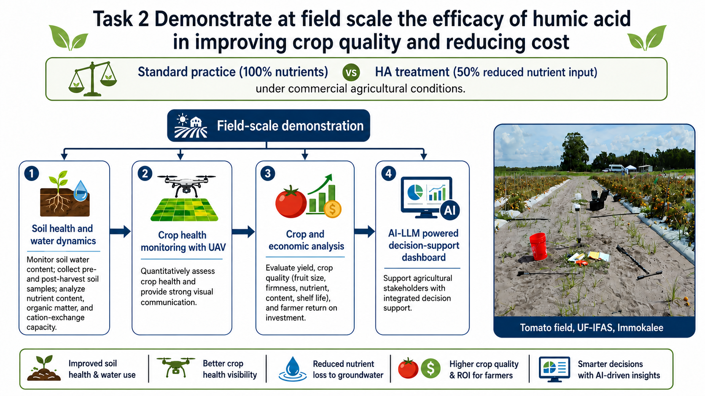
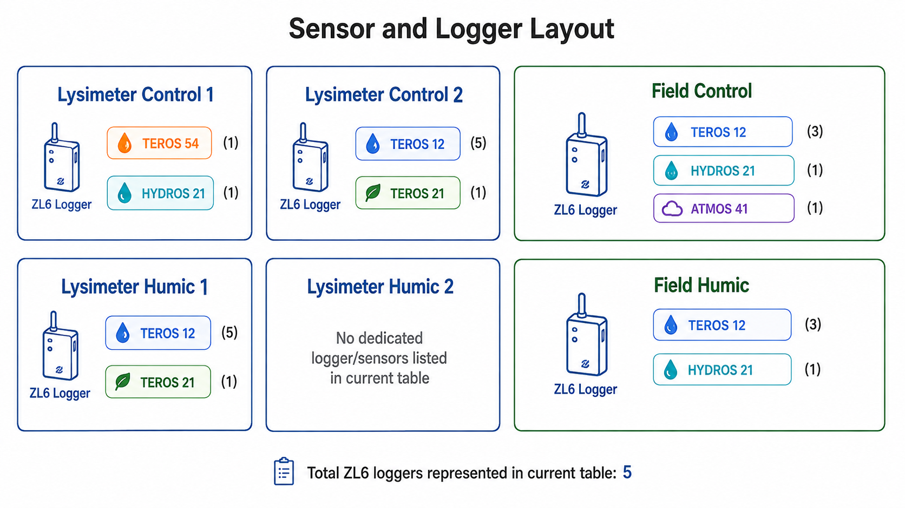
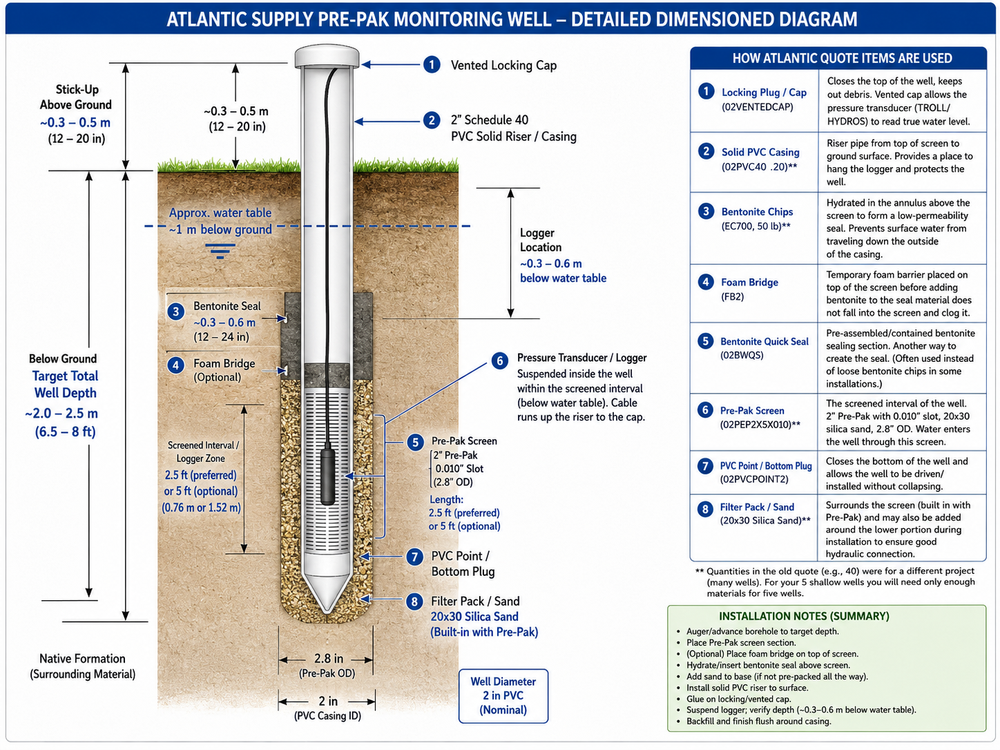

# Task 2 — Field-Scale Validation

  <strong>Project status — implementation phase.</strong> The January 2027 field launch is being prepared. Quantities described as targets, hypotheses, or planned outcomes are <strong>not project results</strong> and will be replaced with measured results as they become available.

## Objective

Scale the controlled findings from Task 1 to commercial tomato-production conditions and evaluate environmental performance, crop response, and economic feasibility.

## Core field comparison

The field trial compares **standard practice at 100% recommended nutrients** with a **humic-acid treatment using approximately 50% reduced nutrients** under field conditions. The final randomized plot design, treatment timing, cultivar, and operational rates will be fixed in the approved field/QAPP documents.

<b>Soil health & water</b>
Track soil water dynamics and key soil properties such as nutrient status, organic matter/carbon, and cation-exchange behavior.

<b>Groundwater & leaching</b>
Use shallow groundwater monitoring and water-quality sampling to evaluate nutrient movement beyond the root zone.

<b>Crop health by UAV</b>
Use repeated hyperspectral imagery to map canopy vigor, vegetation indices, nitrogen status, and water stress.

<b>Yield & economics</b>
Quantify marketable yield and fruit quality, then evaluate costs, savings, and return on investment.

## Monitoring architecture

The planned field program combines soil sensors, water-level monitoring, meteorological data, irrigation records, groundwater wells, laboratory analyses, UAV observations, and crop measurements. This creates a synchronized dataset for interpreting both treatment performance and environmental variability.

Planning-stage sensor/logger layout. Final field allocation will be updated after installation and QAPP approval.

## Shallow groundwater monitoring

Monitoring wells within and adjacent to the experimental area will support assessment of groundwater levels and nutrient concentrations. The exact number, screen intervals, and locations should be updated here after installation is complete.

Planning illustration for a shallow monitoring well. Replace with the final as-built diagram and surveyed elevations after installation.

## UAV and crop-health monitoring

The proposal calls for repeated UAV-mounted hyperspectral surveys, with processing to produce orthomosaics and crop-health indicators such as NDVI/related vegetation indices, chlorophyll-related measures, and water-stress indicators. These products will serve both quantitative analysis and stakeholder communication.

## Economic question

A central field-scale decision is whether any reduction in fertilizer and operational costs can be achieved **without compromising marketable yield or fruit quality**. The economic analysis is therefore integrated with agronomic and water-quality outcomes rather than treated as a separate end-of-project calculation.

## Current status

The experimental site visit and initial site selection have been completed. Procurement and installation planning for lysimeters, sensors, water-level loggers, groundwater-well materials, humic acid, and related supplies is underway, alongside final QAPP and sampling decisions.
