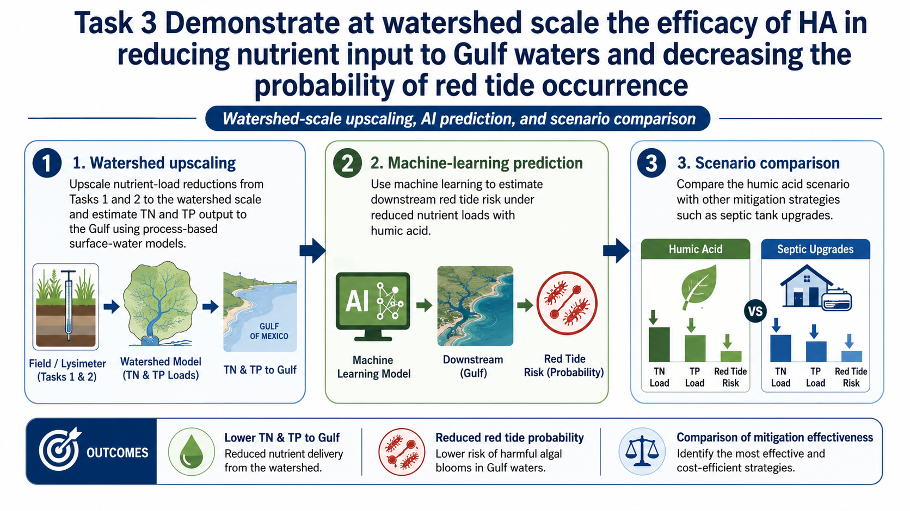

# Task 3 — Watershed, Red Tide & Decision Support

  <strong>Project status — implementation phase.</strong> The January 2027 field launch is being prepared. Quantities described as targets, hypotheses, or planned outcomes are <strong>not project results</strong> and will be replaced with measured results as they become available.

## Objective

Translate field-verified nutrient reductions into watershed and coastal-management implications by combining process-based watershed modeling, machine learning, and an interactive stakeholder decision-support system.

Task 3a<h3>Watershed nutrient-load modeling</h3>
Use the existing Peace River Watershed Assessment Model (WAM) to compare baseline conditions with humic-acid adoption scenarios using qualified results from Tasks 1 and 2.

Task 3b<h3>Machine-learning red-tide assessment</h3>
Use nutrient-load scenario outputs with the existing <i>Karenia brevis</i> model to estimate scenario-based changes in bloom probability, frequency, and severity.

Task 3c<h3>LLM-powered decision support</h3>
Integrate project data, model outputs, Earth-observation products, and economic information into source-supported natural-language guidance for stakeholders.

## Task 3a — Watershed upscaling

The primary scenario design compares a **baseline scenario** representing current land use and standard agricultural practice with a **humic-acid adoption scenario** in which agricultural parameters are updated using accepted treatment effects measured in Tasks 1 and 2. Sensitivity and uncertainty analyses will document how assumptions about treatment effect, adoption, hydrology, and management influence estimated TN and TP load reductions.

## Task 3b — Red-tide response

The project team has an existing machine-learning classifier for *Karenia brevis* conditions in Charlotte Harbor. Task 3b will use accepted watershed-model outputs and the environmental variables required by the existing model to compare predicted bloom behavior across nutrient-management scenarios. Model performance, uncertainty, and domain limitations will be documented with the scenario results.

## Task 3c — Stakeholder dashboard

The decision-support concept is designed to move beyond static reports. Farmers, extension personnel, and watershed managers will be able to query qualified project information in natural language and receive source-supported summaries, tables, and maps. The prototype page below is intentionally a **shell**, ready to be connected to project data later.

  
<b>HA Decision Support</b>Prototype — data connection pending

  

    
Map / field / watershed layer viewer

    

How does 50% nutrient reduction affect watershed TN loading?

Scenario results will appear here after Task 3a outputs pass QA review.

Ask a project question…

  

## Scenario comparison framework

Beyond baseline versus HA adoption, the project planning presentation identifies broader management comparisons (for example, alternative nutrient-mitigation strategies) as a management question. Those comparisons should only be added to the public results page after the scenario definitions and cost basis are finalized.
