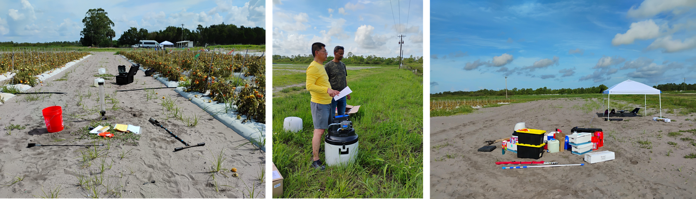
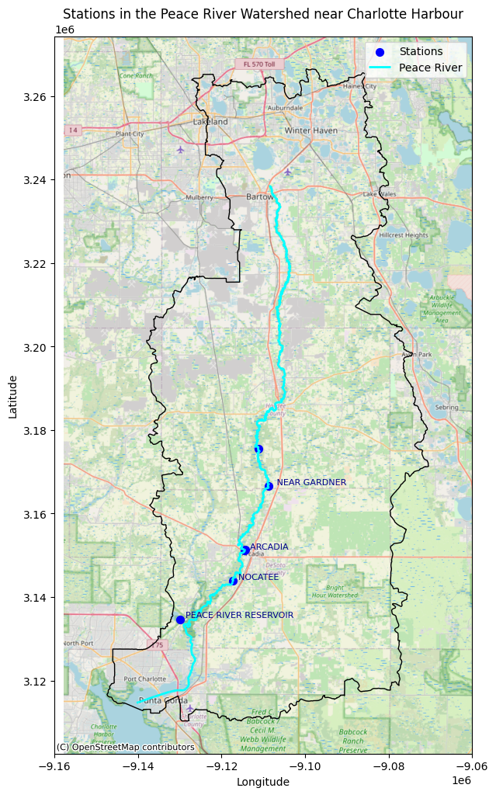

# Study Areas: From Immokalee to the Coast

  <strong>Project status — implementation phase.</strong> The January 2027 field launch is being prepared. Quantities described as targets, hypotheses, or planned outcomes are <strong>not project results</strong> and will be replaced with measured results as they become available.

The project is organized around a **farm-to-coast pathway**. Controlled and field experiments are centered at the University of Florida/IFAS Southwest Florida Research and Education Center (SWFREC) in Immokalee. Watershed-scale analysis focuses on the Peace River watershed, with downstream interpretation in Charlotte Harbor and Gulf receiving waters.

  
1<b>Immokalee / SWFREC</b><small>Lysimeter + field experiments</small>

  
2<b>Agricultural landscape</b><small>Upscaling of measured treatment effects</small>

  
3<b>Peace River watershed</b><small>WAM nutrient-load scenarios</small>

  
4<b>Charlotte Harbor</b><small>Receiving water + red-tide prediction</small>

## Experimental site — Immokalee, Florida

The experimental design targets representative sandy agricultural soils, reliable irrigation access, and field conditions suitable for lysimeter, sensor, and groundwater-monitoring infrastructure. Site selection also considers drainage and flooding conditions and the ability to implement consistent treatment application.

Field-site photographs from the project planning presentation. Replace or expand this gallery as field activities progress.

## Watershed and coastal study domain

Peace River–Charlotte Harbor modeling context used by the project team.

### Additional project locations

The proposal also identifies DeSoto County agricultural lands for watershed-scale modeling, Charlotte and Lee counties for downstream receiving-water analysis, and Fort Myers for project data analysis and modeling at FGCU.

## What will be added later

- Final experimental plot map and GPS-referenced well/sensor locations.
- Site soil profile and hydraulic characterization.
- UAV basemaps and treatment boundaries.
- Watershed land-use and subbasin layers used in Task 3.
- Links to public monitoring datasets and model products once approved for release.
